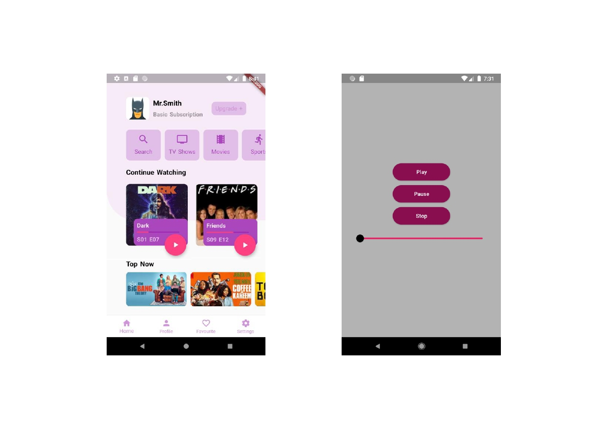

# Flutter-Music--Player-Part
This repository mainly consist of the UI design of a streaming service application.

It can do two main function: 
- When clicked on first button an audio plays
- Clicking on second button a pop up shows

